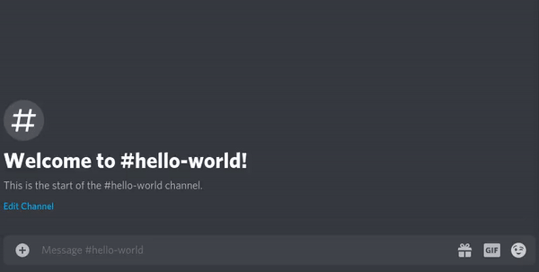

Um chatbot pro Discord feito em **Extreme** **GO** **Horse**
## Instalação
0. Clone o repositório;
0. Instale o GO;
    - [Windows](https://www.digitalocean.com/community/tutorials/how-to-install-go-and-set-up-a-local-programming-environment-on-windows-10-pt)
    - [Linux](https://www.youtube.com/watch?v=dQw4w9WgXcQ)
0. Vá para a pasta do repositório, que provavelmente tu já sabe como fazer :D
0. Coloque o [token do Discrd Bot](https://discord.com/developers/applications) dentro do arquivo `token`;
0. Instale a lib [discordgo](https://github.com/bwmarrin/discordgo), executando `go get github.com/bwmarrin/discordgo` aí no terminal;
0. Compile o programa executando `go build main.go` no terminal;
0. E se alguma coisa der errado você não é o escolhido.

## Comandos
- `!user <usuário>`

    

 
Outros comandos serão adicionados quando eu tiver criatividade pra tal.