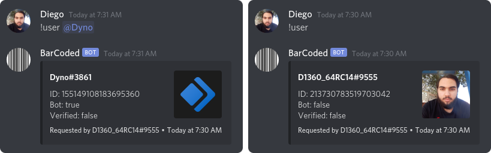
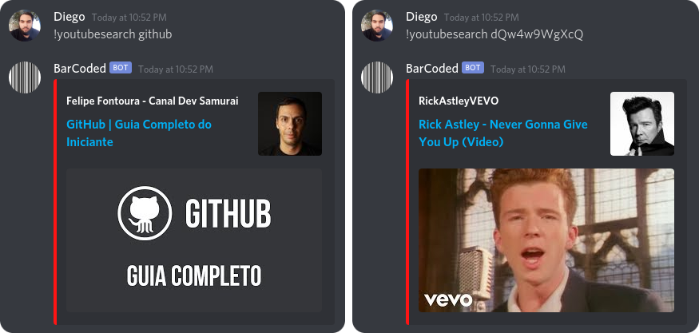

Um chatbot pro Discord feito em **GoLang**

## Instalação
0. Clone o repositório;
0. Instale o GO;
    - [Windows](https://www.digitalocean.com/community/tutorials/how-to-install-go-and-set-up-a-local-programming-environment-on-windows-10-pt)
    - [Linux](https://www.youtube.com/watch?v=dQw4w9WgXcQ)
0. Vá para a pasta clonada;
0. Coloque o [token do Discord Bot](https://discord.com/developers/applications) e da [API do YouTube](https://console.developers.google.com/apis/credentials) dentro do arquivo `config.yml` *(no lugar de `AYAYAAA` e `EXPLOSION`)*;
0. Instale a lib [discordgo](https://github.com/bwmarrin/discordgo), executando `go get github.com/bwmarrin/discordgo` no terminal;
0. Compile o programa executando `make build`;
0. E se alguma coisa der errado, você não é o escolhido!

## Comandos
### !user <@usuário>
Mostra informações sobre o perfil do usuário. 
Caso utilizado sem mencionar nenhum usuário, será exibido informações de seu perfil. 
Out:

### !ping
Retorna um `Pong!` 
Útil para saber se o Bot está vivo.

### !comandos OU !commands
Retorna toda a lista de comandos. 
Out: *Comandos disponíveis: `!user, !ping, !youtubesearch`*

### !youtubesearch \<pesquisa> OU \<video id>
Mostra informações sobre o vídeo pesquisado. 
Inicialmente mostra apenas 1 resultado.

---
Outros comandos serão adicionados quando eu tiver criatividade pra tal.
